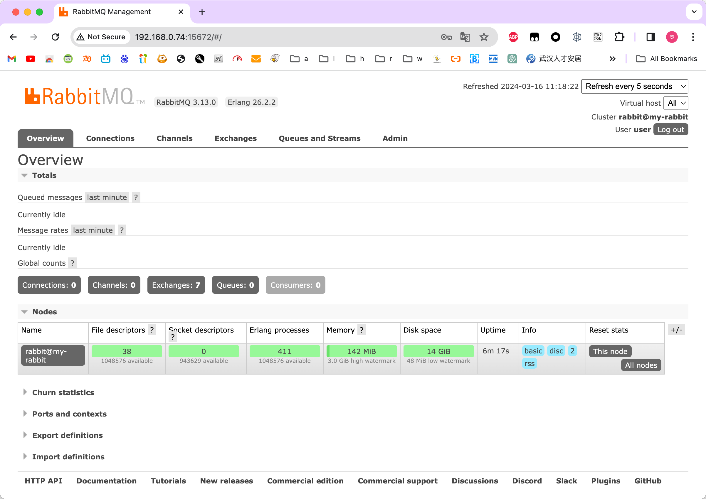

# rabbitmq 学习项目

⚠️注：本项目完全参照 [rabbitmq 官方教程](https://www.rabbitmq.com/tutorials/tutorial-one-java)

## 安装 rabbitmq
这里采用 docker 安装
```groovy
version: '3.9'
services:
  rabbitmq:
    image: rabbitmq:3-management
    container_name: some-rabbit
    hostname: my-rabbit
    environment:
      - RABBITMQ_DEFAULT_USER=user
      - RABBITMQ_DEFAULT_PASS=password
    ports:
      - "5672:5672"
      - "15672:15672"
```

打开 http://localhost:15672 即可看到 rabbitmq  控制台

